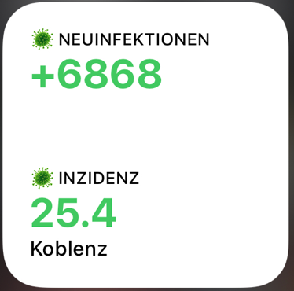

# ScriptableApp Scripts
This repository is a list of public shared gists for the wonderful ScriptableApp

| Script Name | Purpose | Image | Gist-Link|
| --- | --- | --- | --- |
| Corona Incidents | display Covid19 incidence and new cases in your location |  | [gist link](https://gist.githubusercontent.com/oliverandrich/0f34c8d4e6de4b6ff32937c584009a65/raw/64bbfd3f2aa9550aae5440de1deb8f84e98e4c93/incidens_and_newcases.js) | 
| ToiletPaper Availability | check if your local DM market has enough toilet paper |  | [gist link](https://gist.github.com/marco79cgn/23ce08fd8711ee893a3be12d4543f2d2) | 

# Contribution
Feel free to add your favorite scripts via an issue and a Merge Request.